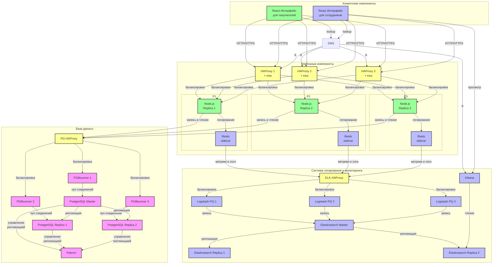

```mermaid

graph TD

    subgraph "Клиентские компоненты"
        A1[React Интерфейс<br/>для покупателей]
        A2[React Интерфейс<br/>для сотрудников]
    end

    A1[React Интерфейс<br>для покупателей] -->|lookup| DNS
    A2[React Интерфейс<br>для сотрудников] -->|lookup| DNS
    DNS -->|A| E4[Kibana]
    DNS -->|A| B2[HAProxy 2<br>+ кэш]
    DNS -->|A| B3[HAProxy 3<br>+ кэш]

    subgraph "База данных"
        D0[PG HAProxy] -->|балансировка| D1[PGBouncer 1]
        D0[PG HAProxy] -->|балансировка| D3[PGBouncer 2]
        D0[PG HAProxy] -->|балансировка| D5[PGBouncer 3]
        D1[PGBouncer 1] -->|пул соединений| D2[PostgreSQL Master]
        D3[PGBouncer 2] -->|пул соединений| D4[PostgreSQL Replica 1]
        D5[PGBouncer 3] -->|пул соединений| D6[PostgreSQL Replica 2]
        D2[PostgreSQL Master] -->|репликация| D4[PostgreSQL Replica 1]
        D2[PostgreSQL Master] -->|репликация| D6[PostgreSQL Replica 2]
        D2[PostgreSQL Master] -->|управление<br>репликацией| D7[Patroni]
        D4[PostgreSQL Replica 1] -->|управление<br>репликацией| D7[Patroni]
        D6[PostgreSQL Replica 2] -->|управление<br>репликацией| D7[Patroni]
    end

    subgraph "Replicaные компоненты"
        A1[React Интерфейс<br>для покупателей] -->|HTTP/HTTPS| B1[HAProxy 1<br>+ кэш]
        A1[React Интерфейс<br>для покупателей] -->|HTTP/HTTPS| B2[HAProxy 2<br>+ кэш]
        A1[React Интерфейс<br>для покупателей] -->|HTTP/HTTPS| B3[HAProxy 3<br>+ кэш]

        A2[React Интерфейс<br>для сотрудников] -->|HTTP/HTTPS| B1[HAProxy 1<br>+ кэш]
        A2[React Интерфейс<br>для сотрудников] -->|HTTP/HTTPS| B2[HAProxy 2<br>+ кэш]
        A2[React Интерфейс<br>для сотрудников] -->|HTTP/HTTPS| B3[HAProxy 3<br>+ кэш]

        subgraph P1
            C1[Node.js<br>Replica 1]
            F1[Beats<br>sidecar]
        end

        subgraph P2
            C2[Node.js<br>Replica 2]
            F2[Beats<br>sidecar]
        end

        subgraph P3
            C3[Node.js<br>Replica 3]
            F3[Beats<br>sidecar]
        end

        B1[HAProxy 1<br>+ кэш] -->|балансировка| C1[Node.js<br>Replica 1]
        B1[HAProxy 1<br>+ кэш] -->|балансировка| C2[Node.js<br>Replica 2]
        B1[HAProxy 1<br>+ кэш] -->|балансировка| C3[Node.js<br>Replica 3]

        B2[HAProxy 2<br>+ кэш] -->|балансировка| C1[Node.js<br>Replica 1]
        B2[HAProxy 2<br>+ кэш] -->|балансировка| C2[Node.js<br>Replica 2]
        B2[HAProxy 2<br>+ кэш] -->|балансировка| C3[Node.js<br>Replica 3]

        B3[HAProxy 3<br>+ кэш] -->|балансировка| C1[Node.js<br>Replica 1]
        B3[HAProxy 3<br>+ кэш] -->|балансировка| C2[Node.js<br>Replica 2]
        B3[HAProxy 3<br>+ кэш] -->|балансировка| C3[Node.js<br>Replica 3]

        C1[Node.js<br>Replica 1] -->|запись и чтение| D0[PG HAProxy]
        C2[Node.js<br>Replica 2] -->|запись и чтение| D0[PG HAProxy]
        C3[Node.js<br>Replica 3] -->|запись и чтение| D0[PG HAProxy]

        C1[Node.js<br>Replica 1] -->|логирование| F1[Beats<br>sidecar]
        C2[Node.js<br>Replica 2] -->|логирование| F2[Beats<br>sidecar]
        C3[Node.js<br>Replica 3] -->|логирование| F3[Beats<br>sidecar]
    end

    DNS -->|A| B1[HAProxy 1<br>+ кэш]

    subgraph "Система логирования и мониторинга"
        E2[Elasticsearch Master] -->|репликация| E5[Elasticsearch Replica 1]
        E2[Elasticsearch Master] -->|репликация| E6[Elasticsearch Replica 2]
        F1[Beats<br>sidecar] -->|метрики и логи| E3[ELK HAProxy]
        F2[Beats<br>sidecar] -->|метрики и логи| E3[ELK HAProxy]
        F3[Beats<br>sidecar] -->|метрики и логи| E3[ELK HAProxy]
        E3[ELK HAProxy] -->|балансировка| E7[Logstash PQ 1]
        E3[ELK HAProxy] -->|балансировка| E8[Logstash PQ 2]
        E3[ELK HAProxy] -->|балансировка| E9[Logstash PQ 3]
        E7[Logstash PQ 1] -->|запись| E2[Elasticsearch Master]
        E8[Logstash PQ 2] -->|запись| E2[Elasticsearch Master]
        E9[Logstash PQ 3] -->|запись| E2[Elasticsearch Master]
        A2[React Интерфейс<br/>для сотрудников] -->|просмотр| E4[Kibana]
        E4[Kibana] -->|чтение| E6[Elasticsearch Replica 2]
    end

    style A1 fill:#9f9,stroke:#333,stroke-width:2px
    style A2 fill:#bbf,stroke:#333,stroke-width:2px
    style B1 fill:#ff9,stroke:#333,stroke-width:2px
    style B2 fill:#ff9,stroke:#333,stroke-width:2px
    style B3 fill:#ff9,stroke:#333,stroke-width:2px
    style C1 fill:#9f9,stroke:#333,stroke-width:2px
    style C2 fill:#9f9,stroke:#333,stroke-width:2px
    style C3 fill:#9f9,stroke:#333,stroke-width:2px
    style D0 fill:#ff9,stroke:#333,stroke-width:2px
    style D1 fill:#f9f,stroke:#333,stroke-width:2px
    style D2 fill:#f9f,stroke:#333,stroke-width:2px
    style D3 fill:#f9f,stroke:#333,stroke-width:2px
    style D4 fill:#f9f,stroke:#333,stroke-width:2px
    style D5 fill:#f9f,stroke:#333,stroke-width:2px
    style D6 fill:#f9f,stroke:#333,stroke-width:2px
    style D7 fill:#f9f,stroke:#333,stroke-width:2px
    style E2 fill:#bbf,stroke:#333,stroke-width:2px
    style E3 fill:#ff9,stroke:#333,stroke-width:2px
    style E4 fill:#bbf,stroke:#333,stroke-width:2px
    style E5 fill:#bbf,stroke:#333,stroke-width:2px
    style E6 fill:#bbf,stroke:#333,stroke-width:2px
    style E7 fill:#bbf,stroke:#333,stroke-width:2px
    style E8 fill:#bbf,stroke:#333,stroke-width:2px
    style E9 fill:#bbf,stroke:#333,stroke-width:2px
    style F1 fill:#bbf,stroke:#333,stroke-width:2px
    style F2 fill:#bbf,stroke:#333,stroke-width:2px
    style F3 fill:#bbf,stroke:#333,stroke-width:2px

```
